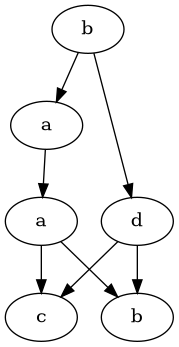

# Grafy Diekerta i Postać Normalna Foaty

Ten projekt skupia się na wykorzystaniu algorytmów do wyznaczania niezależnych zadań, które mogą być wykonywane równolegle bez konfliktów. Do tego celu implementuje się grafy Diekerta oraz oblicza Normalną Formę Foaty (FNF) dla danego słowa.

Ten plik README wyjaśnia obsługę programu: oczekiwany format wejściowy, sposób uruchomienia oraz krok po kroku opisuje algorytmy zaimplementowane w `main.py` (zgodnie z dołączonym kodem).

## Struktura projektu

Główna implementacja znajduje się w pliku `main.py`.

Inne istotne pliki:

- `task/task.py` — dataclass `Task` (pola: `task_id`, `variable`, `new_value`).
- `utils/topo_sort.py` — sortowanie topologiczne (DFS) używane przy obliczaniu FNF.
- `visualization/plot_graph.py` — wykorzystuje Pythonowy pakiet `graphviz` do renderowania grafu Diekerta (wyjście PNG).

## Wymagania

- Python 3.9+ (używa nowoczesnych adnotacji typów jak `list[int]`)
- narzędzi uv (do zarządzania środowiskiem i zależnościami)

## Konfiguracja środowiska

Instalacja zależności Pythona:

```bash
uv sync
```

## Format wejściowy

Program oczekuje pliku JSON z następującymi kluczami:

- `alphabet`: tablica/lista symboli (łańcuchy), np. `["a", "b", "c"]`
- `tasks`: tablica obiektów opisujących zadania. Każde zadanie powinno zawierać:
  - `task_id` — unikalny identyfikator zadania (typ string)
  - `variable` — zmienna, którą zadanie zapisuje/definiuje (typ string)
  - `new_value` — nowa wartość wyrażenia po wykonaniu zadania (typ string)
- `word`: łańcuch złożony z symboli z `alphabet` reprezentujący cią zadań do wykonania, np. "abac"

Przykładowy plik JSON:

```json
{
    "alphabet": ["a", "b", "c", "d"],
    "tasks": {
        "a": {
            "variable": "x",
            "new_value": "x + y"
        },
        "b": {
            "variable": "y",
            "new_value": "y + 2*z"
        },
        "c": {
            "variable": "x",
            "new_value": "3*x + z"
        },
        "d": {
            "variable": "z",
            "new_value": "y - z"
        }
    },
    "word": "baadcb"
}

```

## Jak uruchomić

Uruchom w tej samej lokalizacji co `main.py`:

```bash
# uruchom z niestandardowym plikiem wejściowym
uv run main.py path/to/input.json
```

lub

```bash
# domyślnie używa examples/example1.json
uv run main.py
```

Program wykona kolejno:

- parsowanie wejścia
- budowę relacji zależności i niezależności
- utworzenie grafu słowa oraz obliczenie grafu Diekerta
- wygeneruje graf Diekerta do pliku `graph_<word>.png`
- wypisze zbiory relacji i Postać Normalną Foaty na standardowe wyjście

## Algorytmy — opis i zamysł

Poniżej znajdują się opisy algorytmów zaimplementowanych w `main.py`. Wyjaśniają one zamysł i kroki działania.

### 1) Graf zależności (D)

Zamysł:

- Relacja zależności to symetryczna relacja dwuargumentowa pomiędzy symbolami (lub zadaniami) wskazująca, że dwa symbole (zadania) nie mogą być zamieniane miejscami, ponieważ jeden korzysta z drugiego (konflikt odczyt/zapis).

Implementacja (zgodnie z `main.py`):

- Dla każdej pary zadań (a, b):
    - Jeżeli zadanie jedno z zadań odczytuje wartość zmiennej z drugiego zadania (tj. `b.variable` pojawia się w `a.new_value`), to oba zadania są ze sobą zależne, więc dodajemy do grafu zależności krawędź między nimi

Pseudokod:

```
dla każdego zadania a <- zbiór zadań:
    dla każdego zadania b <- zbiór zadań:
        jeżeli zmienna z zadania b czyta wartość zmiennej z zadania a:
        dodaj zależność między zadaniem a i zadaniem b
```

Złożoność: O(n^2 * m), gdzie n to liczba zadań, a m to maksymalna długość wyrażeń `new_value` (sprawdzanie odczytu zmiennej).

### 2) Graf niezależności (I)

Zamysł:

- Niezależność (I) to dopełnienie relacji zależności na tym samym zbiorze wierzchołków (bez par refleksywnych): para (x,y) jest niezależna jeśli nie są zależne.

Implementacja (w `main.py`):

- Dla każdego zadania wybierane są wszystkie zadania, które nie są z nim zależne (tj. nie ma krawędzi w grafie zależności) i dodawna jest krawędź niezależności między nimi.

Pseudokod:
```
I = { (a,b) | a <- zbiór zadań, b <- zbiór zadań, (a,b) nie należy do D }
```

Złożoność: O(n^2) sprawdzeń, każde sprawdzenie to odczyt z set-a O(1).

### 3) Graf słowa

Zamysł:

- Graf słowa modeluje ograniczenia porządkowe pomiędzy pozycjami słowa wejściowego. Wierzchołkami są indeksy (pozycje) w łańcuchu `word` (0..n-1). Istnieje skierowana krawędź z i do j (i < j) jeśli symbol na pozycji j jest zależny z symbolem na pozycji i.

Implementacja (w `main.py`):

- Konstruuje się `dependency_graph` pomiędzy symbolami (lub zadaniami). Dla wszystkich i < j, jeśli `word[j]` należy do `dependency_graph[word[i]]`, dodaje się krawędź i -> j w `word_graph`.

Pseudokod:

```
dla każdego indeksu i <- 0..n-1:
  dla każdego indeksu j <- i+1..n:
    jeżeli word[j] należy do D[ word[i] ]:
      dodaj krawędź i -> j
```

Interpretacja: późniejsze wystąpienia zależne od wcześniejszych muszą następować po nich w każdej linearyzacji.

Złożoność: O(n^2) sprawdzeń, każde sprawdzenie to odczyt z set-a O(1).

### 4) Graf Diekerta (redukcja przechodnia grafu słowa)

Zamysł:

- Graf Diekerta jest redukcją przechodnią grafu słowa: zachowuje tylko bezpośrednie zależności (relacje pokrycia) i usuwa krawędzie wynikające z przechodniości.

Implementacja (w `main.py`):

- Dla każdego wierzchołka `v` w grafie słowa:
  - Uruchom BFS/DFS zaczynając od wszystkich bezpośrednich sąsiadów `v`, aby oznaczyć wszystkie osiągalne węzły. W ten sposób wyznaczymy wszystkie wierzchołki osiągalne pośrednio z `v`. Jeżeli zatem wierzchołek `u` będący sąsiadem `v` jest osiągalny z `v` poprzez inną ścieżkę, to krawędź `v->u` jest zbędna.

Pseudokod:

```
dla v <- wszystkie wierzchołki w word_graph:
  visited = {False for all nodes}

  queue = kolejka
  włóż do kolejki wszystkich bezpośrednich sąsiadów v

  dopóki kolejka nie jest pusta:
    v = pobierz pierwszy element z kolejki
    dla y <- sąsiedzi v:
      jeżeli y nie został odwiedzony:
        odwiedź y
        dodaj y do kolejki

  sąsiedzi v = { u | u <- sąsiedzi v, u nie został odwiedzony }
```

Złożoność: dla każdego wierzchołka uruchamiamy BFS po osiągalnej podczęści grafu: w najgorszym przypadku O(n * (n + m)), gdzie n to długość słowa, a m to liczba krawędzi. Dla gęstych grafów może to dojść do O(n^3), choć zwykle wejścia są małe.

### 5) Normalna Forma Foaty (FNF)

Zamysł:

- FNF grupuje pozycje słowa w sekwencję (listę) zbiorów (warstw), gdzie w każdej warstwie pozycje są parami niezależne, a wszystkie zależności pomiędzy warstwami są zachowane. Każda klasa to krok, w którym zadania mogą być wykonywane równolegle.

Implementacja (używany w `main.py`):

- Oblicz graf Diekerta dla danego słowa.
- Wykonaj sortowanie topologiczne grafu Diekerta (pozycje w kolejności zgodnej z krawędziami skierowanymi).
- Iteruj po pozycjach w kolejności topologicznej i zachłannie umieszczaj każdą pozycję w bieżącej klasie Foaty, jeśli jest niezależna od wszystkich już w klasie; w przeciwnym razie rozpocznij nową klasę. Dzięki sortowaniu topologicznemu zapewniamy, że wszystkie zależności dla zbiorów Foaty są zachowane.

Szczegół implementacyjny (z `main.py`):

- Aby sprawdzić niezależność przy dodawaniu pozycji `p` do bieżącej klasy `C`, kod sprawdza, czy istnieje takie zadanie `q` w `C` takie, że `p` jest zależne od `q`. Jeśli nie istnieje, `p` jest niezależne od wszystkich elementów `C` i jest dodawane; w przeciwnym razie zaczyna się nowa klasa.

Pseudokod:

```
posortuj topologicznie graf Diekerta
klasy Faoty = []
obecna klasa = {topo_sorted[0]}

dla p <- topo_sorted[1:]:
  jeżeli dla wszystkich q w obecnej klasie: (p,q) nie należy do D:
    dodaj p do obecnej klasy
  w przeciwnym razie:
    dodaj obecną klasę do klas Faoty
    obecna klasa = {p}
dodaj obecną klasę do klas Faoty
```

Wynikiem jest lista zbiorów indeksów; podczas wypisywania kod mapuje indeksy z powrotem na litery w wejściowym słowie.

Złożoność: zdominowana przez sortowanie topologiczne i sprawdzenia niezależności; w praktyce O(n^2).

## Sortowanie topologiczne

- `utils/topo_sort.py` implementuje standardowe sortowanie topologiczne oparte na DFS. Odwiedza każdy węzeł, rekurencyjnie odwiedza jego sąsiadów i umieszcza węzeł w tablicy wynikowej przy powrocie — daje to porządek topologiczny dla acyklicznych grafów skierowanych (takich jak np. graf Diekerta).

Złożoność: O(V + E)

## Wyjście

- Program drukuje dwa zbiory relacji: `D` (zależność) i `I` (niezależność). Każdy jest wypisany jako zbiór par uporządkowanych.
- Drukuje Normalną Formę Foaty w postaci `FNF([słowo]) = (klasa1)(klasa2)...` gdzie każda klasa zawiera litery z wejściowego słowa należące do tej klasy.
- Graf Diekerta jest renderowany przy użyciu Graphviz. Nazwa pliku to `graph_<słowo>.png`.

### Przykładowe wyjście dla wejścia z `examples/example1.json`

1. Zbiory relacji zależności:

```plaintext
D = {(a, c), (a, b), (a, a), (b, b), (b, d), (b, a), (c, c), (c, d), (c, a), (d, c), (d, b), (d, d)}
```

2. Zbiór relacji niezależności:

```plaintext
I = {(a, d), (b, c), (c, b), (d, a)}
```

3. Postać Normalna Foaty:

```plaintext
FNF([baadcb]) = (b)(ad)(a)(cb)
```

4. Graf Diekerta w formacie `dot`:

```plaintext
digraph {
	0 [label=b]
	1 [label=a]
	2 [label=a]
	3 [label=d]
	4 [label=c]
	5 [label=b]
	0 -> 1
	0 -> 3
	1 -> 2
	2 -> 4
	2 -> 5
	3 -> 4
	3 -> 5
}
```

5. Plik graficzny `graph_baadcb.png` zawierający wizualizację grafu Diekerta.

