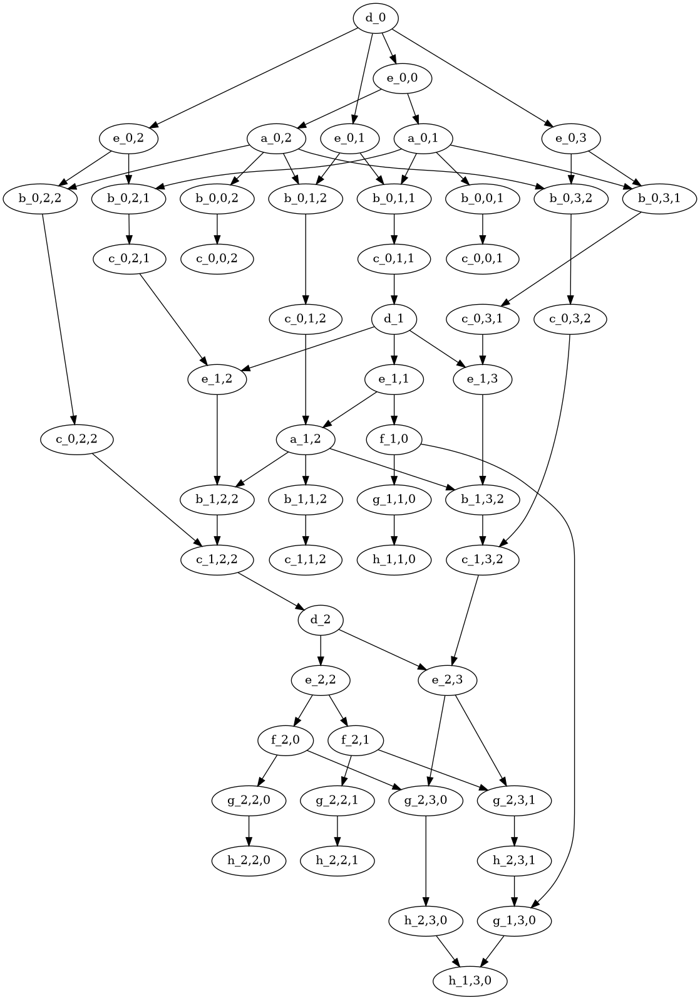
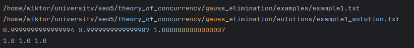

# Eliminacja Gaussa

**Cel ćwiczenia**
- **Zadanie:** Implementacja eliminacji Gaussa z wykorzystaniem współbieżności, wyznaczenie grafów zależności (graf zależności i graf Diekerta) oraz formy normalnej Foaty dla harmonogramu zadań, a także prezentacja wyników i krótkiej analizy wydajności.
- **Motywacja:** Identyfikacja niezależności obliczeń w algorytmie eliminacji, aby umożliwić równoległe wykonywanie kroków i lepiej zrozumieć teorię współbieżności (relacje niezależności, częściowy porządek, Foata).

**Struktura rozwiązania**
- **Główne wejście/uruchomienie:** `main.py`
- **Parser wejścia:** `input_parser/input_parser.py`
- **Model zadania:** `task/task.py`
- **Wizualizacja grafów:** `visualization/plot_graph.py`
- **Przykładowe dane:** katalog `examples`

**Opis algorytmu**
- **Eliminacja:** Dla kolejnych kolumn $ i $ wykonywane są operacje:
  - **zadania $ d_i $** - zapamiętanie elementu diagonalnego
    $$ q_i = M_{i,i} $$
  - **zadania $ e_{i,j} $** - dzielenie wiersza $ i $ przez $ q_i $
    $$ M_{i,j} = M_{i,j} / q_i $$
  - **zadania $ a_{i,k} $** - wyznaczenie współczynnika do odejmowania $i$-tego wiersza od $k$-tego wiersza
    $$ m_{i,k} = M_{k,i} / M_{i,i} $$
  - **zadania $ b_{i,j,k} $** - wyznaczenie składnika do odjęcia - pomnożenie $i$-tego wiersza przez współczynnik do odejmowania od $k$-tego wiersza
    $$ n_{i,j,k} = M_{i,j} \cdot m_{i,k} $$
  - **zadania $ c_{i,j,k} $** - eliminacja wieszy poniżej - odjęcie $j$-tego elementu $i$-tego wiersza od $j$-tego elementu $k$-tego wiersza
    $$ M_{k,j} = M_{k,j} - n_{i,j,k} $$
- **Podstawianie wsteczne:** Dla i od dołu do góry:
  - **zadania $ f_{i,k} $** - wyznaczenie współczynnika do odejmowania $i$-tego wiersza od $k$-tego wiersza
    $$ r_{i,k} = M_{k,i} / M_{i,i} $$
  - **zadania $ g_{i,j,k} $** - wyznaczenie składnika do odejęcia - pomnożenie $i$-tego wiersza przez współczynnik do odejmowania od $k$-tego wiersza
    $$ s_{i,j,k} = M_{i,j} \cdot r_{i,k} $$
  - **zadania $ h_{i,j,k} $** - redukcja wierszy powyżej - odjęcie $j$-tego elementu $i$-tego wiersza od $j$-tego elementu $k$-tego wiersza
    $$ M_{k,j} = M_{k,j} - s_{i,j,k} $$
- **Reprezentacja danych pomocniczych:** wykorzystano wektory pomocnicze m, n, q, r, s (macierze/wektory pomocnicze do czytelnego rozpisania zależności).

**Model współbieżności i grafy zależności**
- **Abstrakcja zadania:** Każda operacja jest reprezentowana jako obiekt klasy **Task** (identyfikator, nazwa zmiennej wynikowej, zbiór używanych zmiennych, funkcja do wykonania). Zależności są wyznaczane na podstawie kolizji w nazwach zmiennych (kto produkuje wartość, którą ktoś inny zużywa).
- **Graf zależności:** Budowany przez wskazanie krawędzi od zadania-producenta do zadania-konsumenta; obrazuje częściowy porządek wykonywania.
- **Graf Diekerta:** Powstaje przez usunięcie krawędzi „przechodnich”, pozostawiając tylko relacje pokrycia (bezpośrednie zależności istotne dla niezależności).
- **Forma normalna Foaty (FNF):** Wyznaczona na podstawie grafu Diekerta poprzez iteracyjne zbiory zadań o zerowym stopniu wejścia — każdy nawias/poziom to porcja niezależnych zadań wykonywanych równolegle.
- **Wykonanie równoległe:** Dla każdej klasy Foaty zadania uruchamiane są w puli wątków (ThreadPoolExecutor), co zapewnia równoległość z zachowaniem częściowego porządku.

**Format danych wejściowych**
- Plik tekstowy:
  - wiersz 1: liczba n (rozmiar układu),
  - wiersze 2..(n+1): n wierszy macierzy A (liczby rozdzielone spacją),
  - wiersz (n+2): wektor b (liczby rozdzielone spacją).

Przykładowy plik `example1.txt`:
```
3
2.0 1.0 3.0
4.0 3.0 8.0
6.0 5.0 16.0
6.0 15.0 27.0
```

**Wyniki programu**
- Wypisywane są: macierz wejściowa A, wektor b, graf zależności, graf Diekerta, forma Foaty, a następnie macierz A oraz wektor b po eliminacji.
- Pliki z wizualizacją grafów są generowane jako obrazy PNG w bieżącym katalogu, pod nazwami graph_&lt;nazwa&gt;.png (np. graph_example3.png oraz graph_example3_diekert.png).
- Na podstawie formy Foaty można odczytać poziomy równoległości i ocenić potencjalne przyspieszenie.

Dla powyższego przykładu wejściowego, przykładowe wyniki to:
- Macierz wejściowa A i wektor b:
```python
A = [[1. 0. 0.]
     [0. 1. 0.]
     [0. 0. 1.]]

b = [[1.]
     [1.]
     [1.]]
```
- Grafy Diekerta:

- Forma Foaty:
```
FNF([d_0; e_0,0; e_0,1; e_0,2; e_0,3; a_0,1; b_0,0,1; b_0,1,1; b_0,2,1; b_0,3,1; c_0,0,1; c_0,1,1; c_0,2,1; c_0,3,1; a_0,2; b_0,0,2; b_0,1,2; b_0,2,2; b_0,3,2; c_0,0,2; c_0,1,2; c_0,2,2; c_0,3,2; d_1; e_1,1; e_1,2; e_1,3; a_1,2; b_1,1,2; b_1,2,2; b_1,3,2; c_1,1,2; c_1,2,2; c_1,3,2; d_2; e_2,2; e_2,3; f_2,1; g_2,2,1; g_2,3,1; h_2,2,1; h_2,3,1; f_2,0; g_2,2,0; g_2,3,0; h_2,2,0; h_2,3,0; f_1,0; g_1,1,0; g_1,3,0; h_1,1,0; h_1,3,0]) = [d_0]
[e_0,0 | e_0,2 | e_0,1 | e_0,3]
[a_0,1 | a_0,2]
[b_0,0,2 | b_0,3,1 | b_0,1,1 | b_0,1,2 | b_0,3,2 | b_0,0,1 | b_0,2,1 | b_0,2,2]
[c_0,2,2 | c_0,2,1 | c_0,1,1 | c_0,0,1 | c_0,0,2 | c_0,3,1 | c_0,1,2 | c_0,3,2]
[d_1]
[e_1,2 | e_1,3 | e_1,1]
[f_1,0 | a_1,2]
[b_1,2,2 | b_1,3,2 | b_1,1,2 | g_1,1,0]
[c_1,2,2 | c_1,3,2 | c_1,1,2 | h_1,1,0]
[d_2]
[e_2,2 | e_2,3]
[f_2,0 | f_2,1]
[g_2,3,0 | g_2,2,1 | g_2,3,1 | g_2,2,0]
[h_2,2,0 | h_2,3,0 | h_2,2,1 | h_2,3,1]
[g_1,3,0]
[h_1,3,0]
```

**Instrukcja uruchomienia**
- Wymagania:
  - Środowisko wirtualne z `uv`
  - Python 3.12 oraz zależności z pyproject.toml.
  - Zainstalowany systemowy Graphviz (dla generowania plików PNG).

Przykładowe uruchomienia w katalogu gauss_elimination:

```bash
# Uruchomienie z przykładowym plikiem
uv run python ./main.py ./examples/example1.txt
```

**Weryfikacja i obserwacje**
- **Poprawność:** Dla przykładowych danych wejściowych uzyskano macierz jednostkową i zredukowany wektor zgodny z przebiegiem eliminacji i podstawiania wstecznego, a kolejność operacji spełniała ograniczenia zależności. Dla zawartych przykładowych macierzy wyniki zostały zweryfikowane przy pomocy [sprawdzarki](https://github.com/macwozni/Matrices) dostarczonej od prowadzącego.

  - Przykładowy wynik dla `example1.txt`:
  

- **Grafy:** Wygenerowane grafy pokazują, które zadania są niezależne (brak krawędzi między nimi) oraz jakie są relacje pokrycia po redukcji przechodniości (graf Diekerta).
- **Równoległość:** Wykonywanie na poziomach Foaty zapewnia brak naruszeń zależności i ujawnia potencjał przyspieszenia; przy max_workers=8 zadania w jednym poziomie wykonują się współbieżnie.

**Analiza wydajności**
- **Granularność zadań:** Rozpisanie operacji na małe, niezależne zadania zwiększa narzut harmonogramowania, ale pozwala lepiej eksponować równoległość.
- **Współbieżność w Pythonie:** Zastosowano wątki; dla operacji na macierzach korzystnych może być także podejście procesowe lub wektoryzacja biblioteczna. W tym ćwiczeniu wybrane zostało podejście z zastosowaniem wątków, ponieważ pozwala to na pokazanie relacji niezależności i implementację schedulera.
- **Skalowalność:** Liczba poziomów Foaty i ich rozmiary zależą od danych wejściowych; im więcej niezależnych operacji, tym większy potencjał zrównoleglenia.

**Wnioski**
- Eliminacja Gaussa naturalnie ujawnia strukturę zależności między operacjami, którą można modelować grafowo i wykorzystać do równoległego wykonania.
- Forma normalna Foaty jest praktycznym narzędziem do wyznaczania porcji zadań wykonywanych współbieżnie przy zachowaniu poprawności.
- Wizualizacja grafów pomaga zrozumieć częściowy porządek i relacje niezależności, a prosty model Task wystarcza do poprawnego harmonogramowania.
